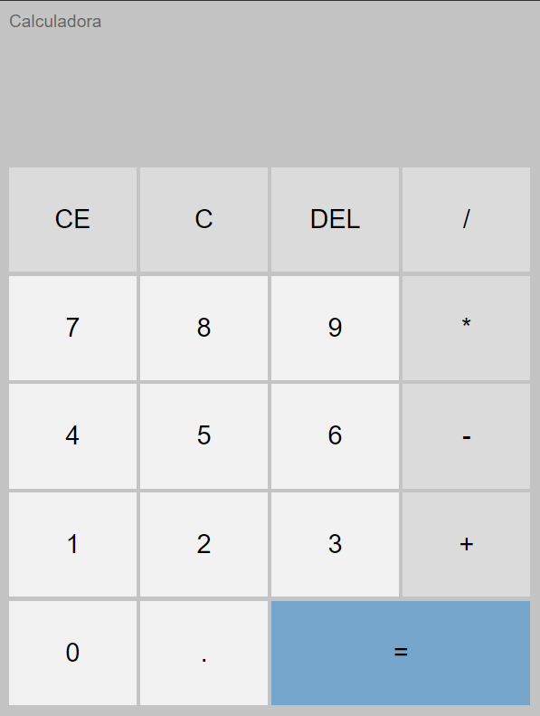

<h1 align="center"> Calculadora JavaScript </h1>

Aplicação front-end desenvolvida com objetivo de praticar e reforçar conceitos de HTML, CSS e JavaScript. 

 

  

- [Acesse o projeto finalizado, online](https://calculadora-javascript-brs.vercel.app/)
  

  

 

## 🚀 Tecnologias

Esse projeto foi desenvolvido com as seguintes tecnologias:

- HTML
- CSS
- JavaScript

 

## 💻 Projeto

- 
 A aplicação consiste em uma calculadora orientada a objetos, inspirada no layout da calculadora do Windows. Dentre as boas práticas utilizadas nesse projeto, podemos destacar o uso de Grid, Flexbox e POO, além de interação através do DOM para capturar eventos do HTML no JavaScript.    

---

Feito por Bernardo Sá com ensino de Matheus Battisti :wave:  
  
[Se inscreva no canal Hora de Codar no Youtube!](https://www.youtube.com/@MatheusBattisti)